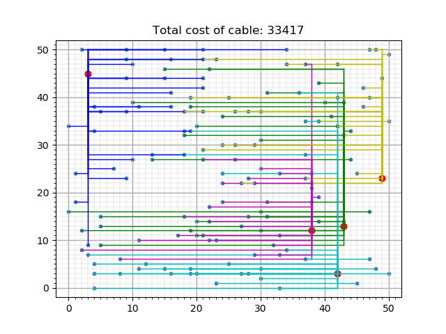

# SmartGrid

## Problem:
When enough houses can generate their own energy, it becomes possible that
excess energy will be generated.  
It's economically beneficial to be able to store that excess energy into batteries for later use, however it is
economically beneficial as well to place and select batteries as strategically
as possible to minimize battery and cable costs. What exactly is the most
economic set-up can result into an astronomically large range of battery and
cable layouts. Thus this program is made to return the most beneficial layout
according to our set of priorities.

#### State Space & Bounds
##### Bounds
The absolute upper and lower bounds of the total costs can be calculated by connecting all houses to the most distant and to the closest battery without checking if the battery is overloaded, which results in:
* Neighbourhood 1:
  * lower: 53188
  * upper: 103030
* Neighbourhood 2:
  * lower: 45268
  * upper: 96253
* Neighbourhood 3:
  * lower: 42757
  * upper: 101491
 
##### State Space
The State Space encompassing every possible combination can be calculated with:
* possible house-battery connections: #houses ^ #batteries  

Which is 150^5 in the first part of the Case.  

In the 2nd part the formula makes use of:
* possible batterylocations: gridsize^#batteries = 2500^5
* possible house-battery connections: #houses ^ #batteries = 150^5  
Which will be added up in the formula due to being independent variables
* #houses ^ #batteries + gridsize^#batteries

which results in:
total state space with 5 batteries:  
* 2500^5 + 150^5

and we predict that no more than 10 batteries will be used.  
Thus having a state space not exceeding:
* 2500^10 + 150^10

## Progress:
Currently we have implemented a greedy algorithm which runs until the constraints are satisfied. The constraint here being maximal capacity of the batteries. We wouldn't want them to explode! Also, the placement of the batteries can be changed.

### This is what our neighbourhood would look like when all houses are simply linked to the nearest battery:

### And this is what the neighbourhood looks like when our greedy algorithm has been implemented:

### And this is the configuration of neighbourhood when battery placement is customized

## Repository layout:
* Our datafiles are stored in the "Huizen&batterijen" folder.
* Processing takes place in the "scripts" folder.
* Output files are stored in the "figures" folder.
* Our testing area is contained in "test_scripts".

## Running the code:

 * run "python smartgrid.py 'Number' 'plot'" in the code folder
 * for number use 1, 2 or 3, this indicates which neighbourhood you want to use
 * for plot either type "plot" if you want intermediate plots to be saved or leave it empty if you don't want intermediate plots.
   * example: "python smartgrid.py 1 plot"
