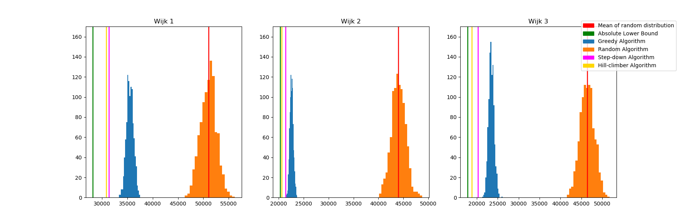

# SmartGrid

## Problem:
When enough houses can generate their own energy, it becomes possible that
excess energy will be generated.
It's economically beneficial to be able to store that excess energy into batteries for later use, however it is
economically beneficial as well to place and select batteries as strategically
as possible to minimize battery and cable costs. What exactly is the most
economic set-up can result into an astronomically large range of battery and
cable layouts. Thus this program is made to return the most beneficial layout
according to our set of priorities.

### State Space & Bounds
#### Bounds
The absolute upper and lower bounds of the total costs can be calculated by connecting all houses to the most distant and to the closest battery without checking if the battery is overloaded, which results in:
* Neighbourhood 1:
  * lower: 53188
  * upper: 103030
* Neighbourhood 2:
  * lower: 45268
  * upper: 96253
* Neighbourhood 3:
  * lower: 42757
  * upper: 101491

However, when the battery placement is changed, the upper and lower bounds will change too. Specifics can be found in [bound.txt](test_scripts/quantify/bound.txt)

##### Bound-Dependent Quantification
To quantify the results per algorithm per neighbourhood we take the 'within-contstraints-impossible absolute upper and lowerbounds' of the neighbourhood as the margin and see wherein this margin our results exist. This will result in percentile values which can be compared within and between neighbourhoods.

#### State Space
The State Space encompassing every possible combination can be calculated with:
* possible house-battery connections: #houses ^ #batteries

Which is 150^5 in the first part of the Case.

In the 2nd part the formula makes use of:
* possible batterylocations: gridsize^#batteries = 2500^5
* possible house-battery connections: #houses ^ #batteries = 150^5
  * is added up in the formula due to being independent variables
* #houses ^ #batteries + gridsize^#batteries

which results in:
total state space with 5 batteries:
* 2500^5 + 150^5

From the possible batttery sets that we've created, we can see that the highest amount of batteries that theoretically will be included equals 17. Thus having a state space not exceeding:
* 2500^17 + 150^17

## Progress:
Currently we have implemented a greedy algorithm which runs until the constraints are satisfied. The constraint here being maximal capacity of the batteries. We wouldn't want them to explode! Also, the placement of the batteries can be changed.

### This is what our neighbourhood would look like when all houses are simply linked to the nearest battery:

### And this is what the neighbourhood looks like when our greedy algorithm has been implemented:

### And this is the configuration of neighbourhood when battery placement is customized:

## The effectiveness of the algorithms
### The Step-Down Algorithm
This self-named algorithm operates by first connecting all houses to its nearest battery and subsequently goes through all overloaded batteries and moves houses from that battery to the next closest battery on the condition that it does not overload that battery, else looks at closest battery after that. This is the reason for the name Step-Down, since it starts at a 'within-constraints impossible high point' and slowly descends downwards, whilst making the total-cost worse, until it reaches a valid house-battery configuration. Because it starts at the same point and follows the same sequence, it will always conclude the same answer. This deterministic result allows this algorithm to be the fastest, but it will not find the best answer. However a recurring pattern occurs when comparing all the battery-location variations per neighbourhood. This pattern is that the variation which has the lowest costs found by the Step-Down Algorithm, is also the variation in which the lowest cost will be found when it comes to the Greedy and the Hill-Climber algorithms. Assuming that this pattern is universally applicable to neighbourhoods, even the ones not yet made, makes the results and the speed of the Step-Down Algorithm a very effective and efficient marker in the selection of battery-location varieties.

### The Greedy Algorithm
In our case the greedy algorithm starts at a random point and runs until it has found a given number of 'successful' iterations, successful meaning that all constraints are met. We chose not to use fixed starting points because these resulted in poor results or infinite loops. Also, by randomizing our starting point we avoid getting stuck in a local optimum. The random starting points mean that the greedy iterates over all houses in a random sequence and finds the cheapest possible solution for each house. The best solution of the given number of iterations is saved with pickle and this configuration can be fully reloaded. We don't keep track of the random sequences that have been used, since the number of variations is immense (factorial of 150).

The greedy  algorithm is very fast with iteration durations ranging from 0.008 to 0.22 seconds. The highest iteration durations occur when running the algorithm for the third dataset (wijk3). This can be explained by the small variation found between the outputs of the houses for this dataset.

### The Hill-Climber Algorithm
The way the Hill Climber Algorithm operates is using a random within constraints algorithm to generate a random House-Battery configuration within the constraints and swapping the connections of two houses which are connected to different batteries. The reason for using this algorithm is to more reliably find a random configuration within the constraints, otherwise we'll have to use completely randomly generated combinations and the odds of finding one which also fits within the constraints is around one in five million when using neighbourhood 1 as a measure or one in three million when using either neighbourhood one or two. This is very inefficient in time and the slight reduction in randomness can be compensated by a proper amount of iterations, which is by our standards 1000

After a battery swap between houses results into a more cost-efficient configuration which fits within the restraints, the swap is kept and the algorithm tries every possible swap again until no better configurations are found. This will with 1000 iterations always result into a more cost-efficient configuration of house-battery combinations than the Step-Down and the Greedy Algorithm, however it takes a significantly longer time to complete the same amount of iterations.

The length of a single iteration is partially dependent on the Greedy Algorithm, and due to it has the same "weakness" as the Greedy Algorithm, which is that the iteration takes longer when there is a very small capacity difference between the total capacity of the batteries and the houses(which is the case in neigbourhood 3).
The other part which influences the length of one iteration is the hillclimber itself and takes in the most time ranging around 7.6-7.9 on average for neighberhood 2 and neighbourhood 1 respectively and around 12.8 seconds on average for neighbourhood 3. The main reason why neighborhood 3 takes almost twice as long is probably the same reason as with the greedy algorithm, the small variation between outputs of houses, that makes it longer to find a suitable direction. Another interesting detail is that neighbourhood 1 not only takes slightly longer on average than neighberhood 2, but also makes twice as much climbs before finding a peak(67 and 30). This can be explained due to neighbourhood 1 having a cluster of batteries of its own which might result into a lot of climbs, but each climb will only include a small increase in cost-efficiency.

We have also tried to create a Hill-Climber which takes two house-battery pairs, but the increase in time length compared to sub-par improvements, made us conclude that it is not worth it to chase this path.

### Clustering:
To find the optimal location for the battery, a density- based clustering algorithm (DBSCAN) is applied to the 'houses-dataset' of each neighbourhood. This algorithms takes multiple parameters, two of which are eps and minPTS. Eps represents the radius of a datapoint in which other datapoints are regarded as part of a cluster. MinPTS represents the minimal number of datapoints in the given radius needed to define a group of datapoints as a cluster. Since the placement of houses differs between the dataset, we chose to iterate over different settings and use only the eps and minPTS values which result in usable clustering.

This clustering is applied in two different fashions. The first of which, aims to find 5 clusters. All the results are tested with our greedy algorithm and the configuration with the lowest outcome will be saved, for later testing with our other algorithms.
The second approach aims to find any configuration with 5, 6, 7, 8, 9, 10, 11, 13 or 17 clusters, because these are the only numbers of batteries we can use to find a profitable battery-set. These sets are profitable because these configurations don't result in redundant amounts of total capacity. This selection also reduces the statespace and runtime immensely.

*Battery options*

### The effectiveness of our greedy and combined "step-down" algorithms are demonstrated in these charts:

*Step down is our combined algorithm where every house is linked to the closest battery, regardless of over-capacity. After this we iteratively change the configuration until the constraints are met. This algorithm is deterministic and therefore will is represented as a line in this graph*

### Other considerations
We considered to implement an archive for the algorithm so we can ensure a randomized starting point which has not been used before, however the odds of that happening is 1 in 150^5. Moreover we don't keep an archive of every house-battery combination at the end of its respective iteration and only keep track of which iteration thus far has found the lowest value, due to the only relevance a certain set of combination has, is if it is the lowest cost of all the iterations.

## Repository layout:
* Our datafiles are stored in the "Huizen&batterijen" folder.
* Processing takes place in the "scripts" folder.
* Output files are stored in the "figures" folder.
* Our testing area is contained in "test_scripts".

## Running the code:

 * run "main.py" in the JSMR repo
 * type in the command line {the number of the neighborhood}-{which algorithm: "stepdown"/"greedy"/"hill"}-{iterations}
   * you can type "spec" if you prefer to insert the details prompt-based
