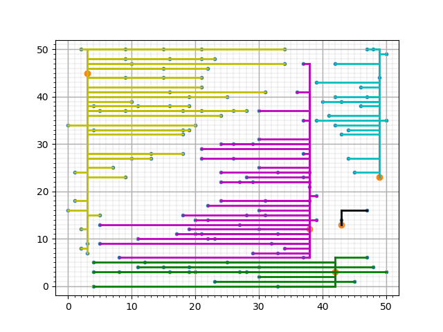
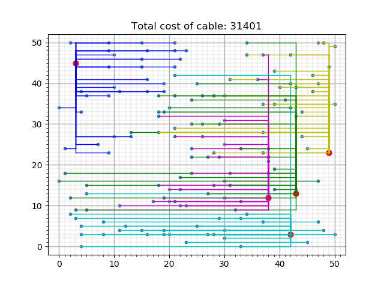
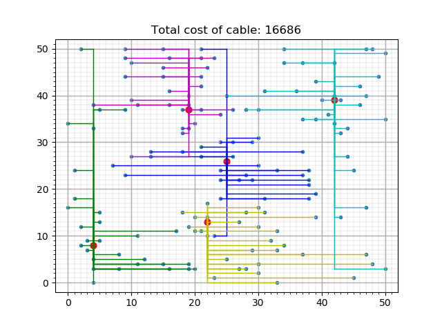
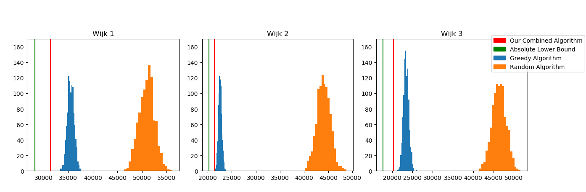

# SmartGrid

## Problem:
When enough houses can generate their own energy, it becomes possible that
excess energy will be generated.  
It's economically beneficial to be able to store that excess energy into batteries for later use, however it is
economically beneficial as well to place and select batteries as strategically
as possible to minimize battery and cable costs. What exactly is the most
economic set-up can result into an astronomically large range of battery and
cable layouts. Thus this program is made to return the most beneficial layout
according to our set of priorities.

### State Space & Bounds
#### Bounds
The absolute upper and lower bounds of the total costs can be calculated by connecting all houses to the most distant and to the closest battery without checking if the battery is overloaded, which results in:
* Neighbourhood 1:
  * lower: 53188
  * upper: 103030
* Neighbourhood 2:
  * lower: 45268
  * upper: 96253
* Neighbourhood 3:
  * lower: 42757
  * upper: 101491
  
However, when the battery placement is changed, the upper and lower bounds will change too. Specifics can be found in [bound.txt](test_scripts/quantify/bound.txt)

##### Bound-dependent Quantification
To quantify the results per algorithm per neighbourhood we take the 'within-contstraints-impossible absolute upper and lowerbounds' of the neighbourhood as the margin and see wherein this margin our results exist. This will result in percentile values which can be compared within and between neighbourhoods.
  

 
#### State Space
The State Space encompassing every possible combination can be calculated with:
* possible house-battery connections: #houses ^ #batteries  

Which is 150^5 in the first part of the Case.  

In the 2nd part the formula makes use of:
* possible batterylocations: gridsize^#batteries = 2500^5
* possible house-battery connections: #houses ^ #batteries = 150^5  
  * is added up in the formula due to being independent variables
* #houses ^ #batteries + gridsize^#batteries

which results in:
total state space with 5 batteries:  
* 2500^5 + 150^5

and we predict that no more than 10 batteries will be used.  
Thus having a state space not exceeding:
* 2500^10 + 150^10

## Progress:
Currently we have implemented a greedy algorithm which runs until the constraints are satisfied. The constraint here being maximal capacity of the batteries. We wouldn't want them to explode! Also, the placement of the batteries can be changed.

### This is what our neighbourhood would look like when all houses are simply linked to the nearest battery:

### And this is what the neighbourhood looks like when our greedy algorithm has been implemented:

### And this is the configuration of neighbourhood when battery placement is customized:

## The effectiveness of the algorithms
### The Step-Down Algorithm
### The Greedy Algorithm
### The Hill-Climber Algorithm
The way the Hill Climber Algorithm operates is by generating a random House-Battery set-up within the constraints and swapping the connections of two houses which are connected to different batteries. After a swap results into a more cost-efficient set-up which fits within the restraints the swap is kept and the algorithm tries every possible swap again until no better set-ups are found. This will with 1000 iterations always result into a more cost-efficient configuration of house-battery combinations than the Step-Down and the Greedy Algorithm, however it takes a significantly longer time to complete the same amount of iterations. The length of single iteration is 

### The effectiveness of our greedy and combined "step-down" algorithms are demonstrated in these charts:

*Step down is our combined algorithm where every house is linked to the closest battery, regardless of over-capacity. After this we iteratively change the configuration until the constraints are met. This algorithm is deterministic and therefore will is represented as a line in this graph*

### Other considerations
We considered to implement an archive for the algorithm so we can ensure a randomized starting point which has not been used before, however the odds of that happening is 1 in 150^5. Moreover we don't keep an archive of every house-battery combination at the end of its respective iteration and only keep track of which iteration thus far has found the lowest value, due to the only relevance a certain set of combination has, is if it is the lowest cost of all the iterations.

## Repository layout:
* Our datafiles are stored in the "Huizen&batterijen" folder.
* Processing takes place in the "scripts" folder.
* Output files are stored in the "figures" folder.
* Our testing area is contained in "test_scripts".

## Running the code:

 * run "main.py" in the JSMR repo
 * follow the prompt instructions to run our program
